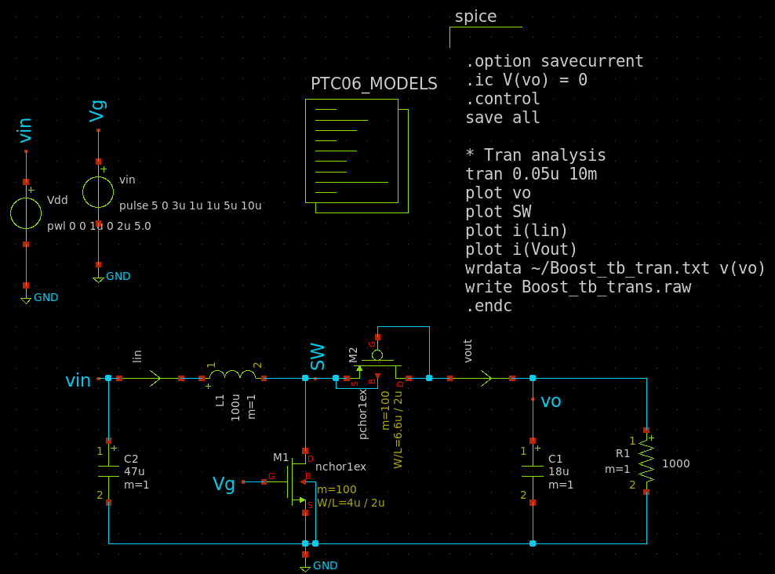
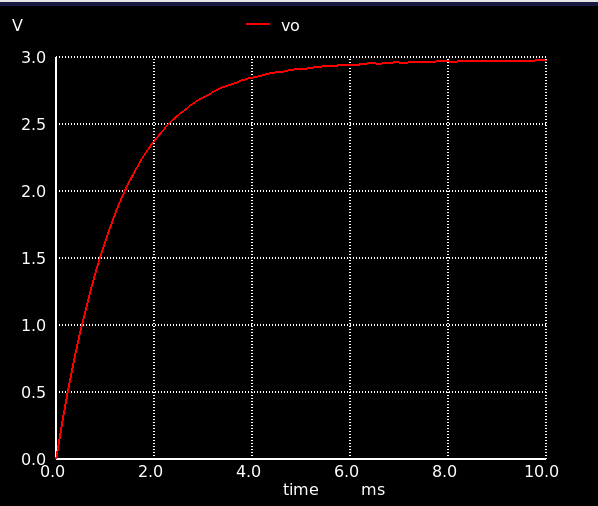
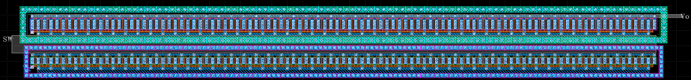

# 昇圧DCDC
##感想
昇圧コンバータのパワー部を始めて設計した。
商用EDAに慣れておりSIMやCADの扱いに若干苦労したがとても楽しかった。
EDA機能は商用より劣るが，フリーかつノートパソコンで手軽に設計できる点では非常素晴らしいと思う。
回路としては期待される動作にならないこと，レイアウト雑になってしまったことが残念だった。
ノイズ対策やばらつき対策を考慮したレイアウトにできなかったので次回あれば挑戦してみたい。

## xschem
- 

## ngspice
- 

## klayout
- 
